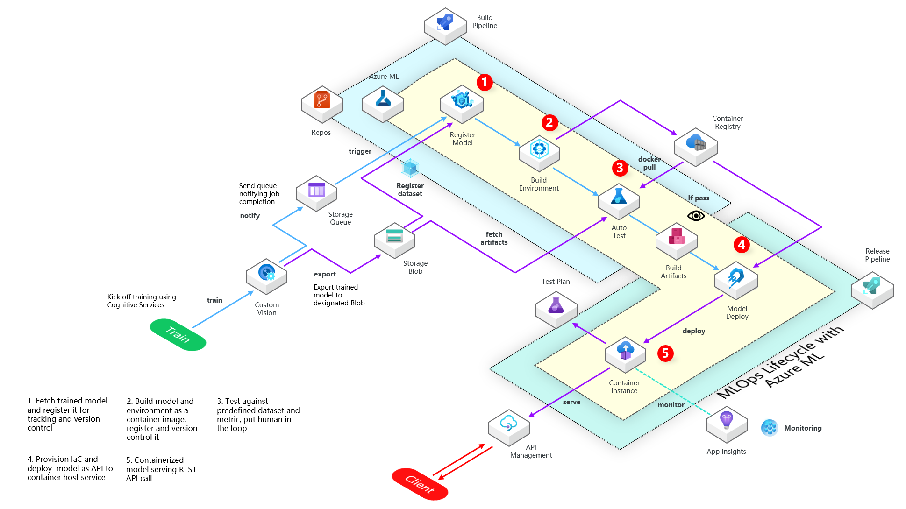

# MLOps with AzureML and Azure DevOps

This tempalte uses Azure ML and Azure DevOps to for Custom Vision MLOps lifecycle management

## How To

### (1) Set up Service Principal
Create an Azure service principal with Contributor access to your AzureML workspace resource.     
Create following two **Variable Groups** in Azure DevOps Pipeline Library

**AzureKeyVaultSecrets**

| Variable name      | Value Description |
| ----------- | ----------- |
| sp_username      | Service principal application (client) ID       |
| sp_password      | Service principal secret       |
| sp_tenantid      | Azure tenant Id      |
| subscription_id      | Azure subscription id      |

**PipelineVariables**

| Variable name      | Value Description |
| ----------- | ----------- |
| artifact_name      | Name of artifacts produced by Build Pipeline (pick any) |

### (2) Set up onfigurations

Change values for the following two config files based on your own environment and needs:    

`aml_config/aml_config.py`    
Add your Azure ML workspace settings in this config

`aml_config/config.py`     
Add your proejct configurations

